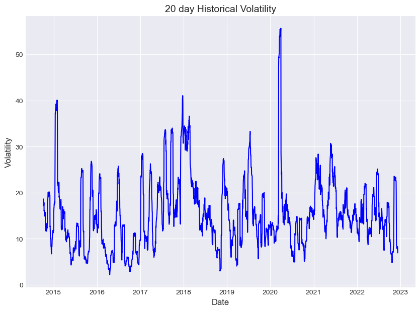

# 1. Import the libraries


```python
import numpy as np
import pandas as pd
import matplotlib.pyplot as plt
plt.style.use('seaborn-darkgrid')
```

# 2. BTC-USD data 


```python
data = pd.read_csv('BTC-USD.csv',parse_dates = ['Date'],  index_col = 'Date')
data.head()
```


<div>
<style scoped>
    .dataframe tbody tr th:only-of-type {
        vertical-align: middle;
    }

    .dataframe tbody tr th {
        vertical-align: top;
    }

    .dataframe thead th {
        text-align: right;
    }
</style>
<table border="1" class="dataframe">
  <thead>
    <tr style="text-align: right;">
      <th></th>
      <th>Open</th>
      <th>High</th>
      <th>Low</th>
      <th>Close</th>
      <th>Adj Close</th>
      <th>Volume</th>
    </tr>
    <tr>
      <th>Date</th>
      <th></th>
      <th></th>
      <th></th>
      <th></th>
      <th></th>
      <th></th>
    </tr>
  </thead>
  <tbody>
    <tr>
      <th>2014-09-17</th>
      <td>465.864014</td>
      <td>468.174011</td>
      <td>452.421997</td>
      <td>457.334015</td>
      <td>457.334015</td>
      <td>21056800</td>
    </tr>
    <tr>
      <th>2014-09-18</th>
      <td>456.859985</td>
      <td>456.859985</td>
      <td>413.104004</td>
      <td>424.440002</td>
      <td>424.440002</td>
      <td>34483200</td>
    </tr>
    <tr>
      <th>2014-09-19</th>
      <td>424.102997</td>
      <td>427.834991</td>
      <td>384.532013</td>
      <td>394.795990</td>
      <td>394.795990</td>
      <td>37919700</td>
    </tr>
    <tr>
      <th>2014-09-20</th>
      <td>394.673004</td>
      <td>423.295990</td>
      <td>389.882996</td>
      <td>408.903992</td>
      <td>408.903992</td>
      <td>36863600</td>
    </tr>
    <tr>
      <th>2014-09-21</th>
      <td>408.084991</td>
      <td>412.425995</td>
      <td>393.181000</td>
      <td>398.821014</td>
      <td>398.821014</td>
      <td>26580100</td>
    </tr>
  </tbody>
</table>
</div>


# 3. Computing Log Returns 


```python
data['Log Returns'] = np.log(data['Adj Close']/data['Adj Close'].shift(1))
```

# 4. Computing Historical Volatility 


```python
data['20 day Historical Volatility'] = 100*data['Log Returns'].rolling(window=20).std()*np.sqrt(20)
```

# 5. Plot the volatility


```python
plt.figure(figsize=(10,7))
plt.plot(data['20 day Historical Volatility'], color = 'b')
plt.xlabel('Date', fontsize = 12)
plt.ylabel('Volatility',fontsize = 12)
plt.title('20 day Historical Volatility',fontsize = 14)
plt.show()
```


    

    


```python

```
